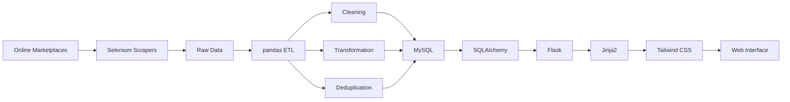
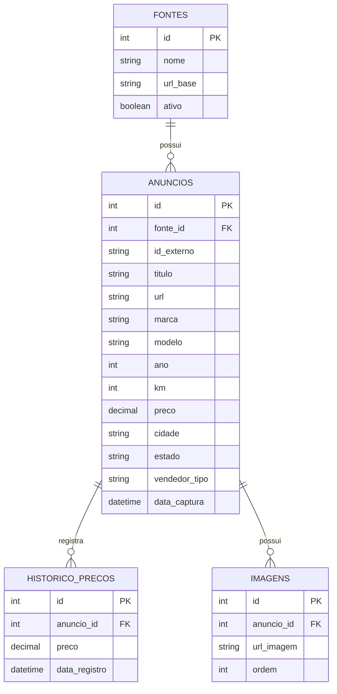

# 🚗 AdCapture

### Intelligent vehicle opportunity discovery platform

[](https://www.python.org/)
[](https://flask.palletsprojects.com/)
[](https://www.selenium.dev/)
[](https://pandas.pydata.org/)
[](https://www.mysql.com/)
[](https://www.sqlalchemy.org/)
[](LICENSE)

> **AdCapture** centralizes vehicle listings from online marketplaces and transforms raw listings into structured data that can be searched, filtered and analyzed through a web application.

---

## 📸 Preview

> **Dashboard e interface do AdCapture**

<!-- Adicione aqui uma imagem real da aplicação -->

<!-- Exemplo:

-->

<p align="center">
  
</p>

---

## 💡 O problema

Encontrar bons veículos para compra e revenda exige acompanhar constantemente diferentes plataformas de anúncios.

O AdCapture automatiza essa etapa, criando um fluxo que:

**captura → trata → armazena → organiza → apresenta**

Em vez de consultar anúncios manualmente, o usuário pode trabalhar com uma base centralizada e utilizar filtros para encontrar veículos dentro dos critérios desejados.

---

## 🎯 O que o projeto faz

* 🔎 Captura anúncios automaticamente
* 🧹 Normaliza e limpa os dados coletados
* ♻️ Remove anúncios duplicados
* 🗄️ Armazena os dados em MySQL
* 🔍 Permite pesquisa e filtros
* 📊 Apresenta indicadores através de um Dashboard
* 🔗 Mantém acesso ao anúncio original
* 🏗️ Possui arquitetura preparada para múltiplas fontes

---

## 🏛️ Arquitetura



### Camadas

| Camada       | Responsabilidade                             |
| ------------ | -------------------------------------------- |
| **Scrapers** | Automação do navegador e coleta dos anúncios |
| **ETL**      | Limpeza, transformação e deduplicação        |
| **Database** | Persistência e organização dos dados         |
| **Backend**  | Regras de aplicação e consultas              |
| **Frontend** | Apresentação, filtros e interação            |

---

## 🛠️ Tech Stack

### Backend & Data

* **Python**
* **Flask**
* **SQLAlchemy**
* **pandas**
* **Selenium**
* **MySQL**

### Frontend

* **Jinja2**
* **Tailwind CSS**
* **Lucide Icons**

### Development

* **Git**
* **GitHub**
* **VS Code**
* **MySQL Workbench**

---

## 📂 Estrutura

```text
AdCapture/
│
├── app.py
├── config/
│   └── settings.py
│
├── src/
│   ├── scrapers/
│   │   ├── base_scraper.py
│   │   ├── driver_factory.py
│   │   └── olx_scraper.py
│   │
│   ├── database/
│   │   ├── connection.py
│   │   ├── models.py
│   │   └── queries.py
│   │
│   ├── etl/
│   │   ├── clean.py
│   │   ├── deduplicate.py
│   │   └── transform.py
│   │
│   └── utils/
│       ├── helpers.py
│       └── logger.py
│
├── templates/
│   ├── base.html
│   ├── anuncios.html
│   └── dashboard.html
│
├── scripts/
├── tests/
├── sql/
│   └── schema.sql
│
├── .env.example
├── requirements.txt
└── README.md
```

---

## 🖥️ Interface

### Dashboard

O Dashboard fornece uma visão rápida da base de anúncios:

* Total de anúncios;
* Novos anúncios;
* Distribuição por marca;
* Cidade com maior quantidade de anúncios;
* Anúncios capturados recentemente.

### Anúncios

A tela principal permite visualizar e explorar os veículos capturados.

Cada anúncio apresenta informações como:

```text
Marca / Modelo
Ano
Quilometragem
Preço
Cidade
Fonte
Data de captura
Link original
```

A busca pode ser refinada através de filtros e ordenação.

---

## 🗄️ Data Model

O banco utiliza um modelo relacional para organizar os anúncios e suas informações relacionadas.



---

## 🔄 Data Pipeline

```text
┌─────────────┐
│   Scraper   │
└──────┬──────┘
       ↓
┌─────────────┐
│ Raw Listings│
└──────┬──────┘
       ↓
┌─────────────┐
│    pandas   │
│     ETL     │
└──────┬──────┘
       ↓
┌─────────────┐
│   Cleaning  │
│ Transform.  │
│ Deduplication│
└──────┬──────┘
       ↓
┌─────────────┐
│    MySQL    │
└──────┬──────┘
       ↓
┌─────────────┐
│ SQLAlchemy  │
└──────┬──────┘
       ↓
┌─────────────┐
│    Flask    │
└──────┬──────┘
       ↓
┌─────────────┐
│ Web Interface│
└─────────────┘
```

---

## 🚀 Getting Started

### Requirements

* Python 3.11+
* Google Chrome
* MySQL
* Git

### Installation

Clone o projeto:

```bash
git clone <URL_DO_REPOSITORIO>
cd AdCapture
```

Crie o ambiente virtual:

```bash
python -m venv .venv
```

Ative o ambiente no Windows:

```bash
.venv\Scripts\activate
```

Instale as dependências:

```bash
pip install -r requirements.txt
```

Configure as variáveis de ambiente:

```bash
copy .env.example .env
```

Configure as credenciais do MySQL no `.env`.

Depois, execute o schema:

```text
sql/schema.sql
```

### Executar a aplicação

```bash
python app.py
```

### Executar o scraper

```bash
python scripts/rodar_scraper_olx.py
```

### Executar o pipeline

```bash
python scripts/executar_pipeline.py
```

---

## 📈 Roadmap

### Core

* [x] Web scraping com Selenium
* [x] Pipeline ETL
* [x] Deduplicação
* [x] MySQL
* [x] Interface Flask
* [x] Busca e filtros
* [x] Dashboard

### Próximas funcionalidades

* [ ] ⭐ Favoritos
* [ ] 📄 Página de detalhes
* [ ] 📉 Histórico de preços
* [ ] 🎯 Perfil de compra
* [ ] 🧮 Score de oportunidades
* [ ] 🔔 Alertas automáticos
* [ ] 🖼️ Captura de imagens
* [ ] ⏱️ Execução automatizada
* [ ] ➕ Novas fontes de anúncios

---

## 🔐 Segurança e privacidade

O projeto utiliza variáveis de ambiente para configurações sensíveis.

Arquivos como `.env`, credenciais e dados reais coletados não devem ser versionados.

Além disso, a coleta automatizada deve respeitar os termos de uso, políticas de acesso e legislação aplicáveis às plataformas utilizadas.

---

## 📚 Principais conceitos aplicados

Este projeto envolve conceitos práticos de:

* Web Scraping;
* Browser Automation;
* ETL;
* Data Cleaning;
* Data Deduplication;
* Relational Databases;
* ORM;
* REST/Web Applications;
* Server-side Rendering;
* Software Architecture;
* Environment Configuration;
* Version Control.

---

## 👨‍💻 Author

**Mateus Diniz**

Computer Science student focused on software development, data and practical technology projects.

[](https://www.linkedin.com/in/mateusdinizz/)
[](https://github.com/)

---

## 📄 License

This project is licensed under the **MIT License**.

See the [`LICENSE`](LICENSE) file for more information.
